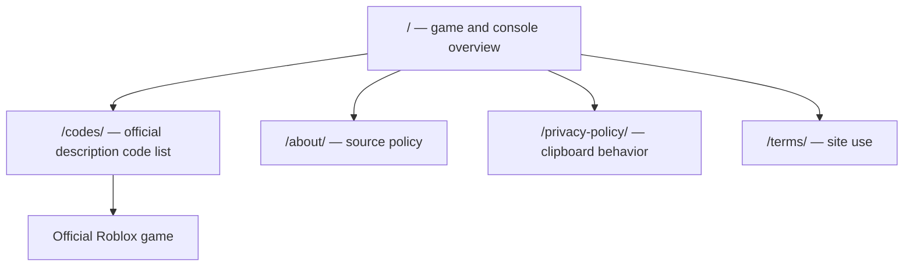

# Win A World Championship — scoped repair plan

Prepared 2026-10-08 by Codex agent. Official identity: Roblox place 117180001724009, universe 10435170241, Black Barn Studios. Page and API agree; public API reports active players.

P0 task: find the official game, obtain codes exactly as listed by its publisher, copy a chosen code and open the game. Description-listed does not mean tested redemption. No invented rewards, eligibility, expiry dates or redemption-menu instructions.

| Route | Intent | Primary information | Main action | Failure fallback |
|---|---|---|---|---|
| / | Identify the game and console control | Official game loop, developer, SELECT toggle, game link | Open Roblox or codes | Source link; no required live API |
| /codes/ | Copy publisher-listed code strings | Timestamped source list; rewards and redemption unverified | Copy one/all; select text manually | Clipboard error and selectable code remain visible |
| /about/ | Check authorship and provenance | Hlele publisher, Codex source review boundary, correction contact | Open source/contact | No fictitious test credentials |
| /privacy-policy/ | Understand copy tool and network behavior | Clipboard only on click; external platform policies | Return to codes | No compliance assertions |
| /terms/ | Understand site scope | Independent companion, code listing limits | Return to overview | Contact link |

Eight invented card archetype routes plus calculator/best-team/beginner/packs/reroll/formations/updates are retired as real 404s, not redirected to unrelated pages. Source archived with manifest; sitemap and navigation include only surviving intended pages. Unproven media removed from rendered content, and fake ratings/pack yields/reward totals removed at their data source.

Indexable: / and /codes/. Policies/about are noindex, follow. Build, source review, clipboard success/failure, retired/random 404 checks, and four-width readability evidence are required before gate pass.
